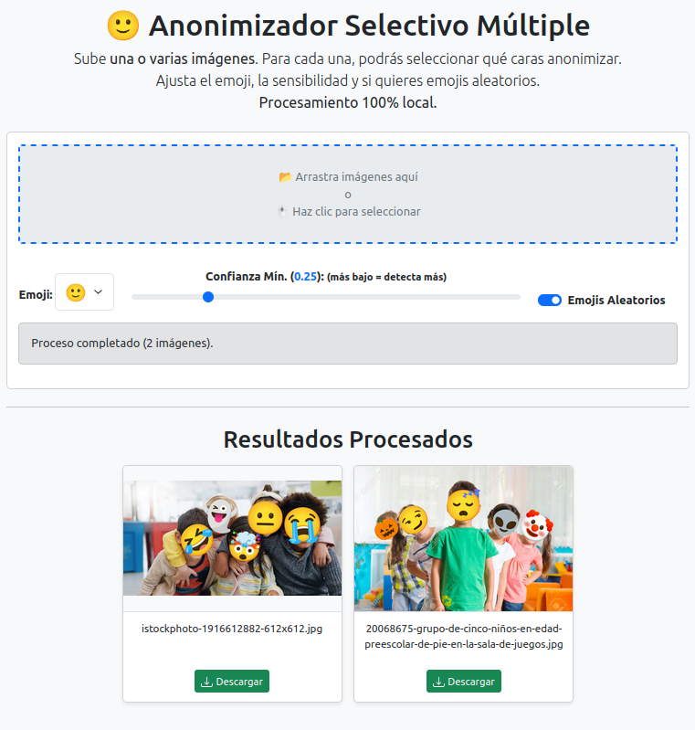

# Face Anonymizer JS

Una sencilla aplicación web para anonimizar caras en imágenes usando emojis. Sube tus fotos, selecciona las caras que quieres cubrir y descarga el resultado. ¡Todo el procesamiento se realiza localmente en tu navegador para máxima privacidad!



## 🚀 Live Demo

Puedes probar la aplicación directamente en tu navegador aquí:

[**>>> Acceder a la Demo en Vivo <<<**](https://soyunomas.github.io/face-anonymizer-js/index.html)

<!-- ====================================================== -->

## ✨ Características

*   **Procesamiento 100% Local:** Tus imágenes nunca salen de tu navegador, garantizando tu privacidad.
*   **Carga Múltiple:** Sube una o varias imágenes a la vez (arrastrar y soltar o seleccionar).
*   **Detección Facial Precisa:** Utiliza `face-api.js` para detectar caras en las imágenes.
*   **Selección Interactiva:** Elige exactamente qué caras quieres anonimizar haciendo clic sobre ellas en un modal.
*   **Opción "Marcar Todas":** Selecciona rápidamente todas las caras detectadas para facilitar la selección.
*   **Personalización de Emoji:** Elige un emoji específico o usa uno aleatorio para cada cara.
*   **Ajuste de Sensibilidad:** Controla el umbral de confianza para la detección de caras y ajusta cuántas caras se detectan.
*   **Descarga Fácil:** Descarga la imagen procesada con un solo clic (formato PNG con nombre de archivo descriptivo).
*   **Interfaz Responsiva:** Construido con Bootstrap 5 para una buena experiencia en diferentes tamaños de pantalla.

## 💻 Tecnologías Utilizadas

*   HTML5
*   CSS3 (con estilos en línea y Bootstrap)
*   [Bootstrap 5.3](https://getbootstrap.com/)
*   JavaScript (Vanilla JS - ES6+)
*   [face-api.js](https://github.com/justadudewhohacks/face-api.js/) (para la detección facial y de puntos clave)

## ⚙️ Cómo Usarlo (Instalación Local)

Esta es una aplicación puramente de lado del cliente. No requiere instalación compleja ni servidor backend para funcionar localmente.

1.  **Clona o Descarga el Repositorio:**
    ```bash
    git clone https://github.com/soyunomas/face-anonymizer-js.git
    cd face-anonymizer-js
    ```
    Alternativamente, puedes descargar el archivo ZIP desde la página principal del repositorio en GitHub y descomprimirlo.

2.  **Abre el Archivo HTML:**
    Simplemente abre el archivo `index.html` (o el nombre principal del archivo HTML que estés usando) directamente en tu navegador web preferido (como Chrome, Firefox, Edge, Safari).

3.  **¡Listo!** La aplicación cargará los modelos de `face-api.js` necesarios (requiere conexión a internet la primera vez que se cargan o si no están en la caché del navegador) y estará lista para que subas tus imágenes.

## 🤔 Cómo Funciona (Resumen Técnico)

1.  **Carga de Modelos:** Al iniciar, la app carga los modelos pre-entrenados de `face-api.js` (detector SSD Mobilenet V1 y predictor de 68 puntos faciales) desde una CDN.
2.  **Carga de Imágenes:** El usuario sube una o varias imágenes a través del input o arrastrando y soltando.
3.  **Cola de Procesamiento:** Las imágenes se añaden a una cola.
4.  **Detección:** Para cada imagen de la cola:
    *   Se carga en un objeto `Image` de JavaScript.
    *   Se dibuja en un canvas temporal (oculto).
    *   `face-api.js` detecta todas las caras (`detectAllFaces`) y sus puntos clave (`withFaceLandmarks`).
5.  **Selección (Modal):**
    *   Si se detectan caras, la imagen original se muestra en un canvas visible dentro de un modal de Bootstrap.
    *   Se dibujan recuadros sobre las caras detectadas.
    *   El usuario puede hacer clic en los recuadros para marcarlos como seleccionados (`selected: true`).
    *   El botón "Marcar Todas" establece `selected: true` para todas las caras detectadas.
6.  **Anonimización:**
    *   Cuando el usuario pulsa "Anonimizar Seleccionadas":
    *   La imagen original se dibuja de nuevo en el canvas temporal.
    *   Se itera sobre las caras marcadas como `selected: true`.
    *   Para cada cara seleccionada: se calcula la inclinación usando los puntos de los ojos, se elige el emoji (fijo o aleatorio), se calcula el tamaño de fuente adecuado y se dibuja el emoji (`fillText`) sobre la cara, aplicando la rotación necesaria.
    *   El contenido del canvas temporal se convierte a un Data URL (PNG).
    *   Se muestra la imagen resultante en la sección de resultados.
7.  **Siguiente Imagen:** El modal se cierra y se pasa a la siguiente imagen de la cola hasta completarla.

## 🤝 Contribuciones

¡Las contribuciones son bienvenidas! Si tienes ideas para mejorar la aplicación, encuentras algún error o quieres añadir nuevas funcionalidades, por favor, siéntete libre de abrir un *issue* para discutirlo o enviar un *pull request*.

## 📄 Licencia

Este proyecto está bajo la Licencia MIT. Consulta el archivo `LICENSE` para más detalles.

<!-- ====================================================== -->
<!-- === ¡IMPORTANTE! Añade un archivo LICENSE === -->
<!-- ====================================================== -->
<!-- 
  *   Crea un archivo llamado "LICENSE" (sin extensión) en la raíz de tu repositorio.
  *   Pega el texto de la Licencia MIT en ese archivo. Puedes encontrarlo fácilmente buscando "MIT License text" en internet.
-->
